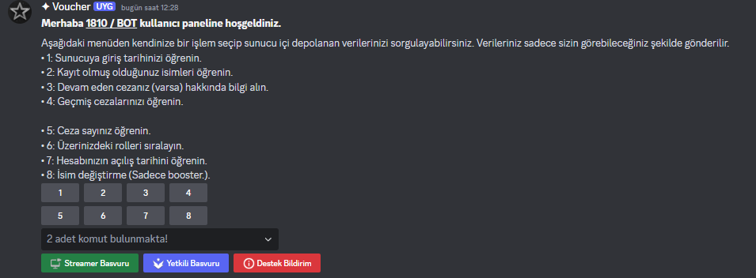
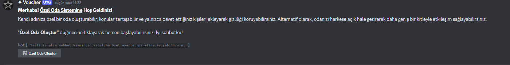
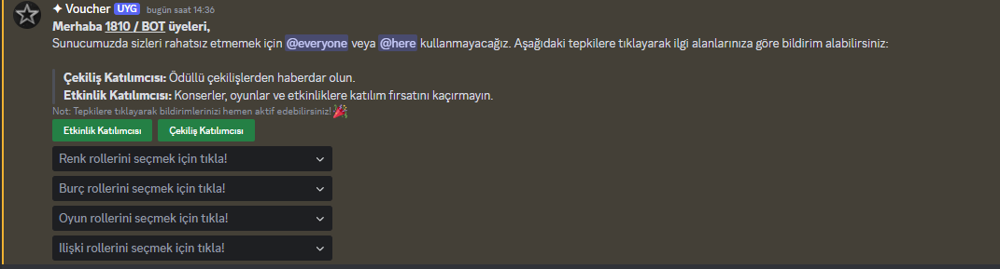
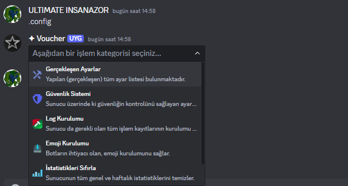
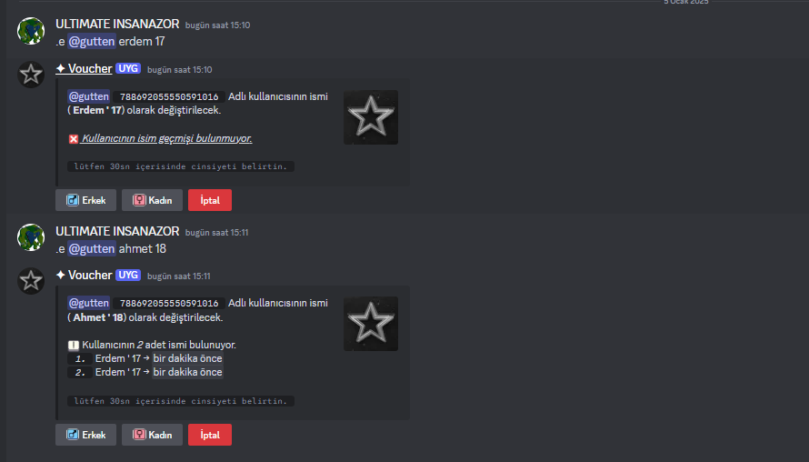

> ### 
 ***TS DISCORD BOTS.*** 
 
  ### 
 *Coming Soon.* 
 
  

Panel Komutları

<table align="center">
  <thead>
    <th>Komut & Sistem</th>
    <th>Resim</th>
  </thead>
<tbody>
  <tr>
  <td>Kullanıcı Panel</td><td></td>
</tr>
<tr>
<td>Özel Oda Panel</td><td></td>
</tr>
<tr>
<td>Rol Menu Panel</td><td></td>
</tr>
</tbody>
</table>

Developer Komutları

<table align="center">
  <thead>
    <th>Komut & Sistem</th>
    <th>Resim</th>
  </thead>
<tbody>
  <tr>
  <td>Setup</td><td></td>
</tr>

</tbody>
</table>

Kayıt Komutları

<table align="center">
  <thead>
    <th>Komut & Sistem</th>
    <th>Resim</th>
  </thead>
<tbody>
  <tr>
  <td>Kayıt</td><td></td>
</tr>

</tbody>
</table>

#
### 
 💎 *Özellikler* 
 
- 🚀 **Kolay Basit Kurulum**: Kullanımı kolay arayüzü sayesinde botu dakikalar içinde kurabilirsiniz.  
- 🛠️ **+90 Komut**: Sunucunuzu daha işlevsel ve eğlenceli hale getiren 90'dan fazla komut.  
- ⚡ **Hızlı Çalışma**: Yüksek performansı ile sorunsuz ve hızlı bir deneyim sunar.  
- 🌐 **Ekip/Public Sunuculara Uygun**: Hem ekip çalışmaları hem de halka açık sunucular için ideal bir çözüm.
  
### 
 ❓ *Gereksinimler* 

- 🖥️ **Node.js v18+**: Botun düzgün çalışabilmesi için en az Node.js v18 veya üzeri bir sürüm gereklidir.  
- 📦 **discord.js v14**: En son özelliklerden yararlanmak için Discord.js kütüphanesinin v14 sürümü kullanılmalıdır.  
- ⚙️ **TypeScript**: Projenin yazılım dili olarak TypeScript kullanıldığı için TypeScript desteği olan bir ortam gereklidir.  
- 💾 **Yeterli Depolama Alanı**: Bot dosyaları ve loglar için minimum ` +100 ` MB boş alan önerilir.  
- 🌐 **İnternet Bağlantısı**: Botun sunucularla iletişim kurabilmesi için kesintisiz bir internet bağlantısı gereklidir.  
- 🛡️ **Gerekli İzinler**: Botun doğru şekilde çalışabilmesi için Discord sunucusunda yönetici izinlerine sahip olması önerilir.

### 
 ☕ *Geliştirici Ve Lisans* 

> ### 
 *Telif Hakkı © 2024 Yiğit 'Nemtycim'. Bu proje GNU Genel Kamu Lisansı v3.0 ile lisanslanmıştır.* 
 
